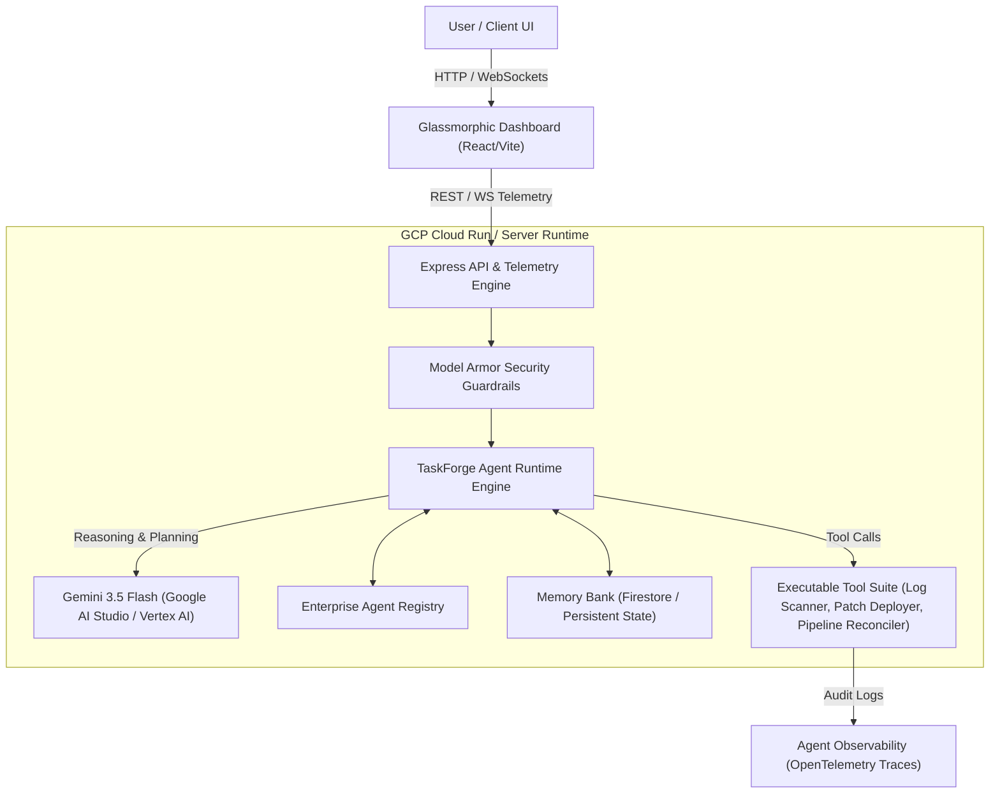

# TaskForge AI - Autonomous Agentic Platform

[](https://cloud.google.com/run)
[](https://aistudio.google.com/)
[](https://github.com/google)
[](https://devpost.com)

**TaskForge AI** is a next-generation autonomous AI agent platform built for the **All Things Agentic Hackathon**. Designed around Google's Gemini 3.5 Flash and Google Agent Development Frameworks (ADK / Antigravity SDK), TaskForge operates asynchronously in the background to automate complex multi-step enterprise workflows, data reconciliations, and security log audits.

---

## 🏗️ System Architecture



---

## ⚡ Key Features & Enterprise Primitives

1. **Autonomous Background Runtime (Agent Runtime):** Operates multi-step planning loops (`Thought -> Action -> Observation -> Result`) without requiring continuous user prompting.
2. **Model Armor Guardrail:** Scans prompts and inputs inline for injection attacks, dangerous tool execution, and PII disclosure.
3. **Memory Bank (Persistent State):** Cross-session persistent storage emulating Firestore, preserving user context across extended timelines.
4. **Agent Registry Catalog:** Centralized directory listing enterprise-approved tools and sub-agents.
5. **OpenTelemetry Observability:** Real-time WebSocket trace streaming of agent thought chains and tool execution logs.

---

## 🚀 Step-by-Step Local Spin-up Guide

### Prerequisites
* **Node.js**: v18.0+ or v24+
* **npm**: v9+
* **Gemini API Key**: (Optional for simulation mode, or get your free key at [Google AI Studio](https://aistudio.google.com/))

### 1. Clone & Install Dependencies
```bash
git clone <your-repository-url>
cd google
npm install
```

### 2. Configure Environment Variables
Copy `.env.example` to `.env`:
```bash
cp .env.example .env
```
Edit `.env` and insert your Gemini API Key:
```env
GEMINI_API_KEY=your_gemini_api_key_here
PORT=3001
GCP_PROJECT_ID=taskforge-agentic-demo
GCP_SERVICE_NAME=taskforge-agent-runtime
```

### 3. Build & Run Application
You can run the full-stack server and UI locally:

**Build Frontend:**
```bash
npm run build
```

**Start Application:**
```bash
npm start
```
Open your browser and navigate to: `http://localhost:3001`

---

## ☁️ Deploying to Google Cloud Run

To deploy TaskForge AI directly to GCP Cloud Run:

```bash
# 1. Build and push container to Google Artifact Registry
gcloud builds submit --tag gcr.io/$GCP_PROJECT_ID/taskforge-agent-runtime:latest .

# 2. Deploy to Cloud Run
gcloud run deploy taskforge-agent-runtime \
  --image gcr.io/$GCP_PROJECT_ID/taskforge-agent-runtime:latest \
  --platform managed \
  --region us-central1 \
  --allow-unauthenticated \
  --set-env-vars GEMINI_API_KEY=$GEMINI_API_KEY
```

---

## 🏆 Submission Deliverables Checklist
- [x] Hosted Web UI / Express Server
- [x] Step-by-Step Spin-up Instructions in README.md
- [x] Visual System Architecture Diagram (Mermaid)
- [x] Gemini 3.5 Flash Integration via `@google/genai`
- [x] Google Agent Framework (ADK & Antigravity primitives)
- [x] Google Cloud Run ready Dockerfile & configuration
